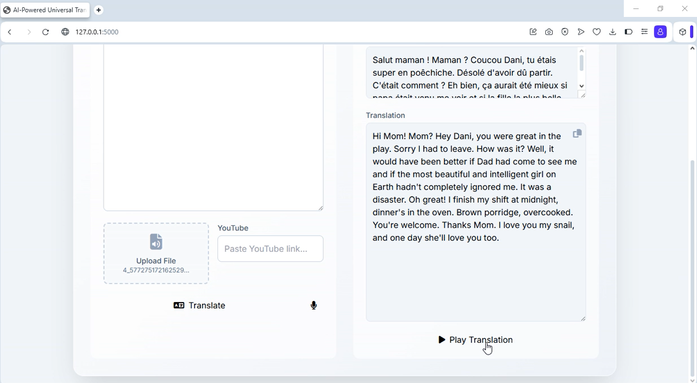
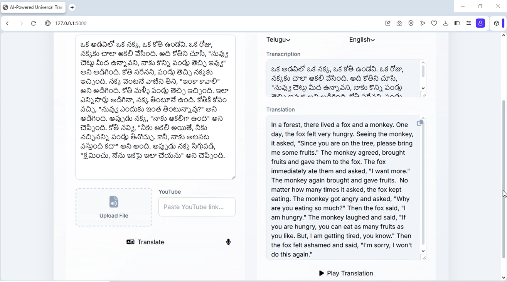

# AI-Translator

This is a comprehensive, AI-powered translation application built with Python and Flask. It serves as a versatile tool to translate content from multiple sources, including text, real-time speech, audio/video files, and YouTube links.

## Demo

A full video demonstration of the application's features is available on my LinkedIn profile.

[Click here to watch the project demo on LinkedIn](https://www.linkedin.com/posts/vidhya2005_artificialintelligence-ai-internship-activity-7354577336253501440-IJzG?utm_source=share&utm_medium=member_desktop&rcm=ACoAAEfX5-cBigB0alaIBvCUD9vnujaKbZESaTQ)

## Features

* **Multi-Modal Input:** Translate from four different sources:
    1.  **Text Input:** Type or paste text for quick translation.
    2.  **File Upload:** Upload audio (MP3, WAV) or video (MP4) files.
    3.  **YouTube Link:** Paste a YouTube URL to translate its audio directly.
    4.  **Real-time Recording:** Use your microphone to capture and translate live speech.
* **Advanced AI Integration:**
    * Utilizes **Google's Gemini API** for highly accurate, AI-powered speech-to-text transcription and language detection.
    * Leverages the `googletrans` library for robust and free text translation.
* **Interactive UI:**
    * A clean, modern, and user-friendly interface built with Flask and Tailwind CSS.
    * Searchable dropdowns for easy language selection.
    * Real-time voice output of translations using the browser's built-in speech synthesis.

## Requirements

To run this project, you will need the following:

#### System Requirements:
* **Python 3.7 or newer.**
* **FFmpeg:** A free command-line tool for handling audio and video.

#### Python Libraries:
You'll need to install the following libraries:
* `Flask`
* `googletrans`
* `pydub`
* `requests`
* `yt-dlp`

#### API Key:
* A free **API key from Google's Gemini** is required for all the audio transcription features (file, YouTube, and microphone).

## Setup and Installation

Follow these steps to run the application on your local machine.

### 1. Install Dependencies

* **System:** First, ensure you have **Python 3.7+** and **[FFmpeg](https://ffmpeg.org/download.html)** installed and added to your system's PATH.
* **Python Libraries:** Install all necessary libraries:
    ```bash
    pip install Flask
    pip install googletrans==4.0.0-rc1
    pip install pydub
    pip install requests
    pip install yt-dlp
    ```

### 2. Configure API Key

This project requires a free API key from Google's Gemini to function.

* Get your key from **[Google AI Studio](https://aistudio.google.com/app/apikey)**.
* Open the `translate.py` file and paste your key into the following variable:

```python
API_KEY = "line 19"
```

### 3. Run the Application

Once the setup is complete, run the application:

```bash
python translate.py
```

Open your web browser and navigate to **`http://127.0.0.1:5000`** to start using the Translator.

---

## Testing

The application was successfully tested using a variety of inputs to demonstrate its full capabilities:

* **Real-time Recording:**
    * The microphone input was tested with spoken **Tamil**, which was successfully transcribed and translated.


* **YouTube URL:**
    * `https://youtube.com/shorts/BbtpBNlOox4?si=RTcIu6pLRkuXybnG` (A short French story).


* **MP3 File:**
    * The application was tested with an MP3 file containing French speech from the following link:
    * `https://media.thefablecottage.com/stories/fr0qb0th7fuv/fr-rapunzel-part1.mp3`


* **MP4 Video from Instagram:**
    * The application was tested with a video from the following link, from which the audio was successfully extracted and translated:
    * `https://www.instagram.com/reel/DJ_JqzQzbkz/?igsh=aGRmaW5md2w1Z2dp`



* **Text (Telugu):**
    ```
    ఒక అడవిలో, ఒక చిన్న కుందేలు ఉండేది. అది ఎప్పుడూ తన స్నేహితులతో ఆడుకుంటూ ఉండేది. ఒకరోజు, అది ఒక పెద్ద పులిని చూసింది. కుందేలు చాలా భయపడి, పారిపోవడానికి ప్రయత్నించింది. కానీ, పులి దానిని వెంబడించింది. కుందేలు ఒక చెట్టు వెనుక దాక్కుంది. పులి దానిని వెతుకుతూ ఉంది. అప్పుడు, కుందేలు ఒక ఉపాయం చేసింది. అది చెట్టు పైకి ఎక్కి, పులికి కనిపించకుండా దాక్కుంది. పులి కుందేలు దొరకలేదని, అలిసిపోయి వెళ్ళిపోయింది. కుందేలు ధైర్యంగా బయటకు వచ్చి, తన స్నేహితులతో కలిసి ఆడుకుంది.
    నీతి: కష్ట సమయంలో ధైర్యంగా ఉండాలి.
    ```
    
---

## 📁 Project Structure
```
AI-Translator/
├── translate.py
└── README.md
```

## 📌 Known Limitations
* Gemini API may have usage quotas.
* Googletrans may occasionally return inaccurate translations for rare languages.
* Audio extraction from Instagram videos can be unstable if authentication is required.

## 👩‍💻 Author
**Vidhya Vinothkumar**

📧 vidhhya.2010@gmail.com
